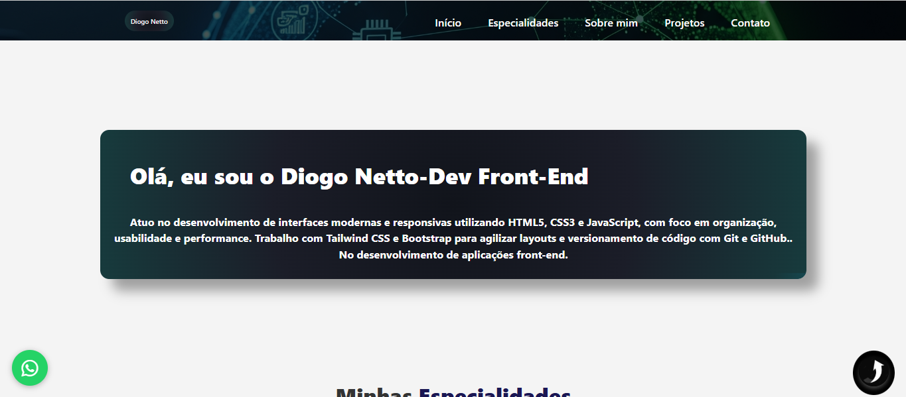

# Portfólio | Diogo Netto

## 📸 Preview do Projeto

Portfólio profissional desenvolvido para apresentar meus projetos e habilidades como **Desenvolvedor Front-End**, com foco em interfaces modernas, responsivas e funcionais.

---

## 👨‍💻 Sobre mim
Sou **Diogo José Morais Netto**, graduado em **Análise e Desenvolvimento de Sistemas**, com experiência prática no desenvolvimento de sites e aplicações front-end. Atuo principalmente com **HTML5, CSS3 e JavaScript**, aplicando boas práticas de usabilidade, organização e performance.  

Atualmente, estudo e aplico **frameworks modernos como React**, além de expandir meus conhecimentos em **Angular e Vue.js**, buscando evolução constante como desenvolvedor.

---

## 🚀 Tecnologias utilizadas
- HTML5  
- CSS3  
- JavaScript  
- Bootstrap  
- Tailwind CSS  
- React.js  
- Git e GitHub  

---

## 📂 Projetos
Neste portfólio estão reunidos projetos de diferentes segmentos, incluindo:
- Sites institucionais  
- Landing pages  
- Sistemas web simples  
- Projetos reais desenvolvidos para clientes  

Todos os projetos foram desenvolvidos com foco em **responsividade**, **design limpo** e **boa experiência do usuário**.

---

## 🌐 Acesse o portfólio
🔗 https://diogo-netto.github.io/Portfolio  

